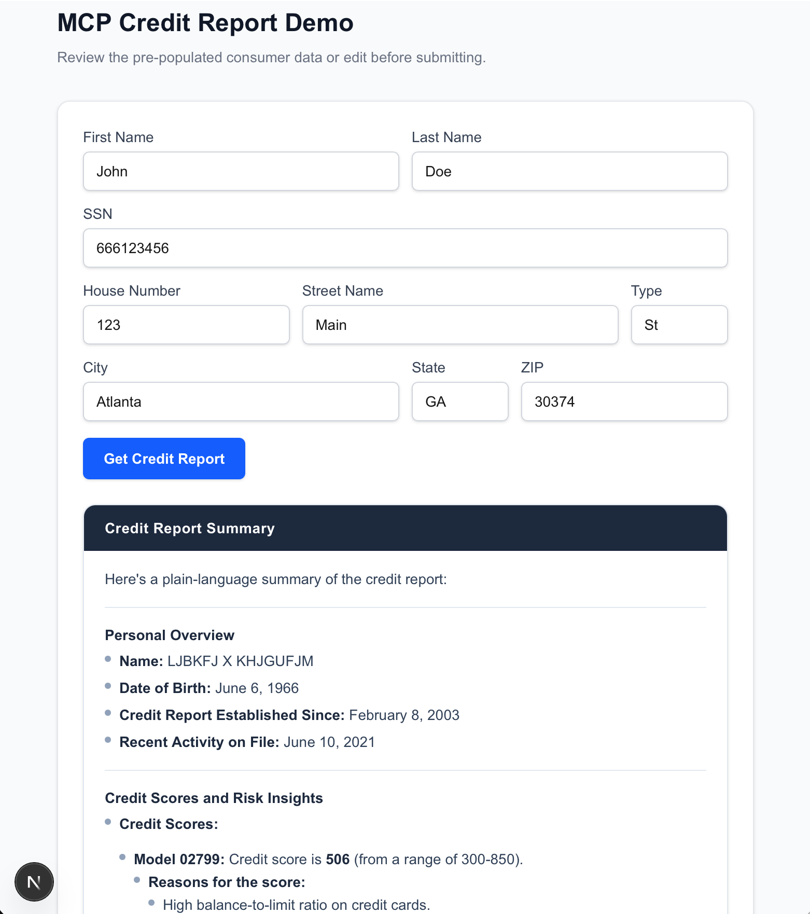

# MCP Credit Report Demo

## Overview

The MCP Credit Report Demo architecture consists of a three-tier separation: a Next.js UI
for presentation, a Hono API Server for orchestration and GPT-4o summarization based on an 
MCP client, and a FastMCP Server for Equifax credit report data with
OAuth handling, where each layer operates independently with strict credential isolation and Zod validation 
at system boundaries to enable secure, scalable component replacement.

It features a three-process TypeScript application that fetches a consumer credit report from the Equifax sandbox API and summarizes it with GPT-4o. 

---

## Architecture Overview

The full architecture is documented in [`docs/architecture.pdf`](./docs/architecture.pdf).

| Process | Port | Role |
|---------|------|------|
| **Next.js** | 3000 | React UI + thin HTTP proxy |
| **API Server** (Hono) | 3002 | MCP client + LLM summarisation |
| **MCP Server** (FastMCP) | 3001 | Equifax data fetching only |

### Next.js — Presentation layer
- Serves the React UI — a pre-populated consumer form read from `consumer.json`
- Handles form state and submits to `/api/credit-report`
- Renders the LLM's markdown response as styled HTML via `react-markdown`
- The API route (`POST /api/credit-report`) is a **thin proxy** — it forwards the request to the API server and returns the response with no business logic

### API Server — Business logic layer
- Built with **Hono** on Node.js
- Connects to the MCP server via `StreamableHTTPClientTransport`, calls the `get_credit_report` tool, parses the JSON result, then calls an LLM to produce a plain-English summary
- All MCP client code and LLM interaction lives here

### MCP Server — Data layer
- Built with **FastMCP** using the Streamable HTTP transport (`/mcp` on port 3001)
- Exposes one tool: `get_credit_report` — validates consumer fields with Zod, fetches an OAuth token from Equifax, posts the OneView credit request, extracts key fields, and returns raw JSON
- No LLM calls — purely a data-fetching layer

---
### Prerequisites

1. Linux or MacOS
2. Nodejs
3. Equifax developer sandbox credentials
4. A GitHub account with LLM access 

---

## Environment Variables

| Variable | File | Used by |
|----------|------|---------|
| `EQUIFAX_CLIENT_ID` | `.env.local`, `mcp-server/.env` | MCP Server — Equifax OAuth |
| `EQUIFAX_CLIENT_SECRET` | `.env.local`, `mcp-server/.env` | MCP Server — Equifax OAuth |
| `GITHUB_TOKEN` | `api-server/.env` | API Server — GitHub Models (GPT-4o) |

---

## Running the App

### Quick Start (Recommended)

Start all three services with a single command:

```bash
# Option 1: Using npm script
npm run dev:all

# Option 2: Running script directly
./start-all.sh
```

This will start:
- MCP Server on port 3001
- API Server on port 3002
- Next.js UI on port 3000

Logs are written to `logs/` directory. Press `Ctrl+C` to stop all services.

Open [http://localhost:3000](http://localhost:3000), review the pre-populated consumer data, and click **Get Credit Report**.



### Manual Start (Alternative)

If you prefer to run each service in a separate terminal:

```bash
# Terminal 1 — MCP server (port 3001)
cd mcp-server && npm run dev

# Terminal 2 — API server (port 3002)
cd api-server && npm run dev

# Terminal 3 — Next.js (port 3000)
npm run dev
```

---

## Testing Script

A standalone test script is available in `testing/api_call.ts` that demonstrates the full flow without the web UI:

```bash
cd testing

export EQUIFAX_CLIENT_ID=your_equifax_client_id_here
export EQUIFAX_CLIENT_SECRET=your_equifax_client_secret_here
export GITHUB_TOKEN=your_github_token_here

npx tsx api_call.ts
```

This script:
1. Obtains an OAuth token from Equifax
2. Fetches a credit report using the data from `consumer.json`
3. Summarizes the report with GPT-4o via GitHub Models
4. Prints the summary to the console

---

## Key Dependencies

| Package | Process | Purpose |
|---------|---------|---------|
| `next`, `react`, `react-dom` | Next.js | React framework |
| `react-markdown` | Next.js | Render LLM markdown as HTML |
| `tailwindcss` | Next.js | Utility-first CSS |
| `hono`, `@hono/node-server` | API Server | HTTP framework |
| `@modelcontextprotocol/sdk` | API Server | MCP client transport |
| `openai` | API Server | GPT-4o via GitHub Models |
| `fastmcp` | MCP Server | MCP server framework |
| `zod` | MCP Server | Tool parameter validation |
| `dotenv` | API + MCP Server | Environment variable loading |
